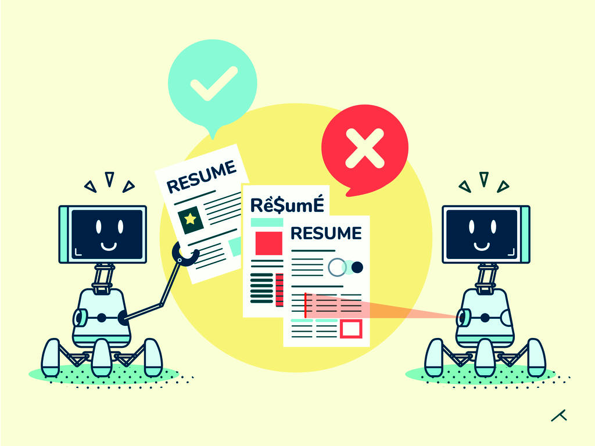

Sure! Based on your request, here's the updated version with the correct repository URL and the changes made accordingly:

Resume Screening 🤖📄
This repository contains a machine learning project focused on automating the resume screening process using Python. The goal is to create a model that efficiently and accurately evaluates resumes based on predefined criteria. 🚀

Table of Contents 📚
Why Automate Resume Screening?
Project Overview
Technologies & Tools 🔧
Application Flow 🔄
AI Innovations in Screening 🧠
Getting Started 🚀
Usage 🖥️
Dataset 📊
Machine Learning Models 🧬
Performance Evaluation 📈
Contributing 🤝
License 📝
Contact Information 📧
Why Automate Resume Screening? 💼
Recruitment processes involve reviewing a huge number of resumes, often in the thousands.
Screening resumes manually is time-consuming, and hiring teams may overlook key details.
Automation helps to reduce human error, accelerate the recruitment process, and ensure a more objective evaluation.
Our solution leverages AI to screen resumes in minutes instead of days, saving both time and effort.
Project Overview 🧐
Resume screening refers to evaluating a candidate’s qualifications based on their resume. By using AI and machine learning, we can automate this process, ensuring faster, unbiased, and more accurate candidate shortlisting.

The goal is to build a smart system that can analyze resumes based on various factors like experience, skills, and education, and suggest the best candidates for each job role.

Technologies & Tools 🔧
This project leverages the following tools and technologies:

Machine Learning & AI Models
KNN (K-Nearest Neighbors): A classification algorithm that makes predictions based on the nearest data points.
Logistic Regression: A simple yet effective model for binary classification.
Support Vector Machines (SVM): A powerful classifier that works well with high-dimensional data.
Random Forest: An ensemble learning method using multiple decision trees to improve accuracy.
Neural Networks: Simulating the human brain to perform complex tasks like resume screening.
Libraries & Frameworks
NumPy: For numerical computations and handling arrays.
Pandas: For data manipulation and analysis.
Matplotlib & Seaborn: For data visualization and insights.
Scikit-learn: For building machine learning models and evaluation.
NLTK: For Natural Language Processing tasks like tokenization and text preprocessing.
Application Flow 🔄
The resume screening process is divided into the following steps:

Data Preprocessing: Clean and structure the resume data (e.g., extracting skills, education, and work experience).
Feature Extraction: Convert resumes into meaningful features for classification (like keywords, experience years, etc.).
Model Training: Train various machine learning models on labeled data.
Resume Screening: Input new resumes into the trained models to predict if the candidate fits the job requirements.
Evaluation: Assess the models’ accuracy, precision, recall, and F1-score.
AI Innovations in Screening 🧠
AI for recruiting is revolutionizing the hiring process! Here's how:

Automated Resume Parsing: AI can automatically parse and analyze resumes to identify key skills, experiences, and qualifications.
Predictive Hiring: AI can predict which candidates are most likely to succeed in a role based on historical data.
Bias Reduction: By using algorithms, AI can help reduce unconscious biases in the hiring process, ensuring a more diverse and equitable candidate pool.
Integration: The technology can seamlessly integrate with existing Applicant Tracking Systems (ATS), streamlining the recruitment process without disrupting workflows.
Getting Started 🚀
To get started with the project:

Clone the repository to your local machine:

bash
Copy
git clone https://github.com/Divabhattacharya/Machine-Learning-.git
cd Machine-Learning-
Install required dependencies:

bash
Copy
pip install -r requirements.txt
Usage 🖥️
Step-by-Step Usage:
Prepare Your Dataset: Ensure you have a collection of resumes in a structured format.
Preprocess the Data: Use the provided scripts to clean and preprocess the resumes.
Train the Model: Train your machine learning models using the Jupyter notebooks.
Predict & Screen Resumes: Use the trained models to classify new resumes.
Dataset 📊
This project uses a dataset of resumes collected from various sources. The dataset includes features like:

Skills (e.g., Python, Java, etc.)
Experience (number of years in a role)
Education (degree, university, etc.)
Data is preprocessed to extract these key features, which are then fed into the machine learning models.

Machine Learning Models 🧬
We use multiple machine learning algorithms to evaluate resumes based on key features. The models included are:

Logistic Regression
Support Vector Machines (SVM)
Random Forest
Neural Networks
Each model is trained and evaluated using accuracy, precision, recall, and F1-score as metrics.

Performance Evaluation 📈
The models are evaluated on their ability to classify resumes accurately. We measure:

Accuracy: How often the model correctly classifies resumes.
Precision: The accuracy of positive predictions (e.g., correctly identifying a qualified candidate).
Recall: The model’s ability to find all relevant candidates.
F1-Score: The balance between precision and recall.
Contributing 🤝
Contributions are welcome! If you have ideas for improvements or new features, feel free to:

Open an issue.
Submit a pull request.
License 📝
This project is licensed under the MIT License. See the LICENSE file for more details.

Contact Information 📧
For any inquiries or collaboration:

Diva Bhattacharya
GitHub:Divabhattacharya

